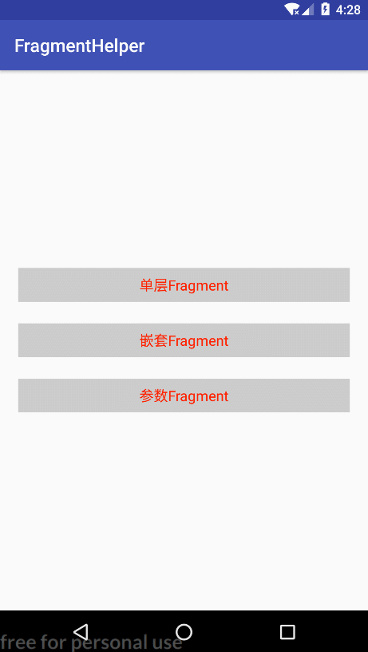

# FragmentHelper


> 专门针对`Fragment`操作的库，封装了复杂的事务提交操作，切换动画和返回栈处理等。

### 效果展示

* 效果图：

  

* `Demo`下载：

  

### 用法

#### 添加依赖

> 在项目主模块中添加如下依赖

```groovy
dependencies{
  compile 'com.yhy.helper:fm-helper:latestVersion'
}
```

#### 在`Activity`中打开`Fragment`

> 单层`Fragment`，不嵌套，所有`Fragment`都基于当前`Activity`

```java
public class SingleActivity extends AppCompatActivity {
  private FmHelper mHelper;

  @Override
  protected void onCreate(@Nullable Bundle savedInstanceState) {
    super.onCreate(savedInstanceState);
    setContentView(R.layout.activity_fm_container);

    mHelper = new FmHelper.Builder(this, R.id.fl_container).build();
    // 打开Fragment
    mHelper.open(new FirstOnFm());
  }

  // 如果在Fragment中还想要打开其他Fragment，就需要调用此方法打开，这样才能保证Fragment被mHelper管理
  public void next(Fragment fm) {
    mHelper.open(fm);
  }

  @Override
  public void onBackPressed() {
    // 管理Fragment回退栈
    mHelper.back();
  }
}
```

#### 嵌套`Fragment`

> 在一个`Fragment`中再创建一堆`Fragment`，这里创建的所有`Fragment`都基于根`Fragment`

* 根`Fragment`所在`Activity`写法

  ```java
  public class MultiActivity extends AppCompatActivity {
    private FmHelper mHelper;
    private RootFm mFm;

    @Override
    protected void onCreate(@Nullable Bundle savedInstanceState) {
      super.onCreate(savedInstanceState);
      setContentView(R.layout.activity_fm_container);
  	// 打开根Fragment
      mHelper = new FmHelper.Builder(this, R.id.fl_container).build();
      mFm = new RootFm();
      open(mFm);
    }

    // 供其它子页面调用，子页面跳转Fragment必须调用，否则mHelper管理部了Fragment栈
    public void open(Fragment fm) {
      mHelper.open(fm);
    }

    @Override
    public void onBackPressed() {
      //如果只有一个根布局，不能直接调用mHelper.back()，这样只会直接结束RootFm，并不会将RootFm中的Fragment逐个退出
      //需要将返回事件交给根Fragment，即RootFm才能实现
      boolean canBack = mFm.back();
      //如果有多个根布局的话，需要根据canBack来判断当前根中的Fragment是否能在继续退出了，不能时才退出当前根
      if (!canBack) {
        mHelper.back();
      }
    }
  }
  ```

* 根`Fragment`写法

  ```java
  public class RootFm extends BaseFragment {
    private FmHelper mHelper;

    @Nullable
    @Override
    protected View initView(LayoutInflater inflater, @Nullable ViewGroup container, @Nullable Bundle savedInstanceState) {
      View view = inflater.inflate(R.layout.fm_fm_root, container, false);
      // 打开Fragment
      mHelper = new FmHelper.Builder(this, R.id.fl_container).build();
      open(new FirstOnFm());
      
      return view;
    }
    
    // 如果在Fragment中还想要打开其他Fragment，就需要调用此方法打开，这样才能保证Fragment被mHelper管理
    public void open(Fragment fm) {
      mHelper.open(fm);
    }

    public boolean back() {
       // 管理Fragment回退栈
      return mHelper.back();
    }
  }
  ```

#### 带参数`Fragment`切换

> 类似`Activity`的`startActivityForResult()`方法，`A`页面跳转到`B`页面，当`B`页面关闭时，需要将数据返回到`A`页面

* 第一步，实现`OnFmCallBack`接口

  > 无论是`A`页面还是`B`页面，都需要实现该接口，不过需要实现的方法不一样，如下

  ```java
  public class SecondOnFm extends BaseFragment implements OnFmCallBack {
    // ...  
    @Override
    public void onResult(Bundle args) {
      // 该方法是用来接收B页面返回的参数的，所有数据都存在Bundle中
      if (null != args) {
        String arg = args.getString("args");
        Toast.makeText(mActivity, "接收到参数：" + arg, Toast.LENGTH_SHORT).show();
      }
    }

    @Override
    public Bundle getResult() {
      // 该方法是用来给A页面返回数据的，保存到Bundle中再返回即可
      Bundle args = new Bundle();
      args.putString("args", "第2页回传的参数");
      return args;
    }
    // ...
  }
  ```

* 第二部，注册和注销数据回调监听器

  > 无论是`A`页面还是`B`页面，都需要注册和注销操作，如下

  ```java
  @Override
  protected void initData(@Nullable Bundle savedInstanceState) {
    // 注册回调监听器
    FmCbManager.getInstance().registFmCallBack(this, this);
  }

  @Override
  public void onDestroy() {
    super.onDestroy();
    // 注销回调监听
    FmCbManager.getInstance().unRegistFmCallBack(this, this);
  }
  ```

#### 其他设置

> 其他个性化设置

* 返回时是否回退到根页面

  > 如果要回退到根页面，就会在所有`Fragment`回退完后显示根页面，否则最后各`Fragment`返回时就退出，默认为不会退到根页面

  ```java
  mHelper = new FmHelper.Builder(this, R.id.fl_container)
    .showRoot(true) // 传true表示显示根页面
    .build();
  ```

* 是否关闭当前`Fragment`页面

  > 只针对关闭`Fragment`，默认为不关闭

  ```java
  mHelper.open(new SecondOnFm(), true); // 传true表示关闭当前Fragment
  ```

* 切换动画

  > 设置`Fragment`的切换动画，不设置时使用默认动画

  ```java
  mHelper = new FmHelper.Builder(this, R.id.fl_container)
    .animate(R.anim.helper_slide_in_right, R.anim.helper_slide_out_left)
    .build();
  ```

----

> `That's all, enjoy it !!!`